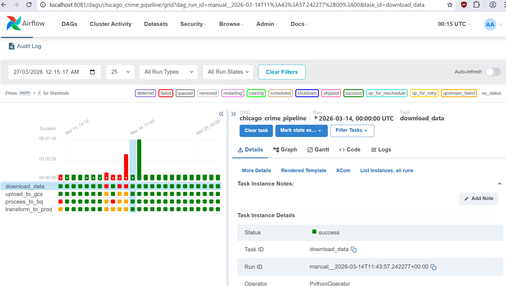
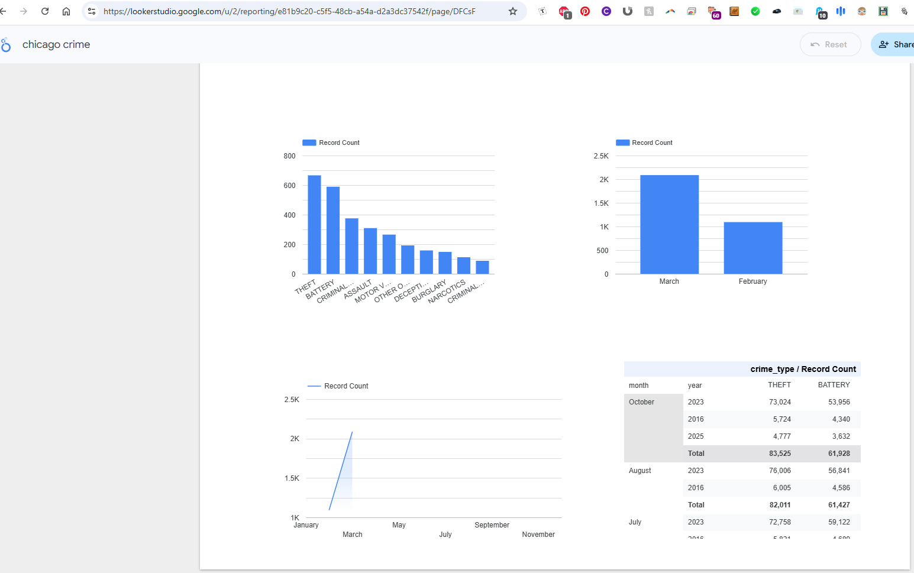

# Chicago Crime Insights Pipeline

End-to-end batch data pipeline for analyzing Chicago Crimes dataset.

## Architecture

- **Cloud**: Google Cloud Platform (GCP)
- **Storage**: Google Cloud Storage (GCS) - Data Lake
- **Warehouse**: BigQuery
- **IaC**: Terraform
- **Orchestration**: Apache Airflow (Docker)
- **Processing**: Apache Spark (PySpark)
- **BI**: Looker Studio

## Data Flow

1. **Ingest**: Python script downloads CSV from Chicago Data Portal, uploads to GCS
2. **Process**: Spark reads CSV, cleans data, writes to BigQuery (Staging)
3. **Transform**: BigQuery SQL creates production table with Partitioning & Clustering
4. **Visualize**: Looker Studio connects to BigQuery

## Repository Structure

```
chicago-crime-pipeline/
├── dags/
│   ├── crime_pipeline_dag.py
│   └── spark_jobs/
│       └── process_crime_data.py
├── terraform/
│   ├── main.tf
│   └── variables.tf
├── docker-compose.yml
├── Dockerfile
└── README.md
```

## Prerequisites

- GCP Account with a Project
- gcloud CLI installed and authenticated
- Terraform installed
- Docker & Docker Compose installed

## Setup

### 1. GCP Service Account

Create a Service Account with roles:
- Storage Admin
- BigQuery Admin
- Service Account User

Download the JSON key to `./credentials/gcp-key.json`

### 2. Infrastructure

```bash
cd terraform
terraform init
terraform apply -var="project_id=YOUR_PROJECT_ID" -var="region=us-central1"
```

### 3. Update DAG Configuration

Edit `dags/crime_pipeline_dag.py`:
- Replace `YOUR_PROJECT_ID` with your actual GCP project ID

### 4. Run Pipeline

```bash
docker-compose build
docker-compose up -d
```

Access Airflow UI at http://localhost:8080 (User: airflow, Pass: airflow)

### 5. Configure GCP Connection

In Airflow UI: Admin -> Connections -> google_cloud_default
- Upload the JSON key file content

### 6. Trigger DAG

Trigger the `chicago_crime_pipeline` DAG in the Airflow UI

## Dashboard

Once complete, go to Looker Studio:
1. Create -> Data Source -> BigQuery
2. Select: your-project -> chicago_crime_data -> prod_crimes

Create visualizations:
- Bar Chart: crime_type dimension, Record Count metric
- Time Series: crime_date dimension, Record Count metric

## Cleanup

```bash
docker-compose down
cd terraform
terraform destroy -var="project_id=YOUR_PROJECT_ID"
```

## Appendix

### Dashboard Screenshots

#### Airflow Pipeline DAG



The screenshot above shows the Airflow DAG execution, including the download, upload to GCS, processing to BigQuery, and transformation to production table.

#### Looker Studio Dashboard



The screenshot above shows the Looker Studio dashboard visualizing Chicago crime data with various charts and filters.
